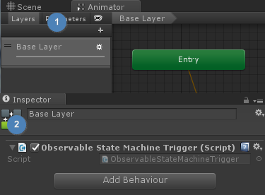

# ObservableStateMachineTrigger

*'ObservableStateMachineTrigger'* provides convenient way to handle various 'Animator' event.

## Setup ObservableStateMachineTrigger

1) Select *'Base Layer'* in a animator controller
2) Add UniRx's *'ObservableStateMachineTrigger'* component

<p align="center">
  
</p>

Now, you can fully retrieve and handle any change of animator's state via *'ObservableStateMachineTrigger'* observable.

``` csharp
ObservableStateMachineTrigger[] triggers;

void Start ()
{
    Animator animator = GetComponent<Animator>();
    if (animator != null)
    {
        triggers = animator.GetBehaviours<ObservableStateMachineTrigger>();

        foreach (ObservableStateMachineTrigger trigger in triggers)
        {
            trigger.OnStateEnterAsObservable()
                .Subscribe(x =>
                {
                    Debug.LogFormat("state name:{0} nameHash:{1} layerIndex:{2}", x.Animator.name, x.StateInfo.shortNameHash, x.LayerIndex);
                })
                .AddTo(this.gameObject);
        }
    }
}
```

Note that UniChan has two layers, *'Base Layer'* and *'Face'*. The above code put log whenever UniChan's animation is changes.

See [ObservableTriggers](http://neue.cc/2015/04/13_510.html) section about other details of ObservableTriggers.
